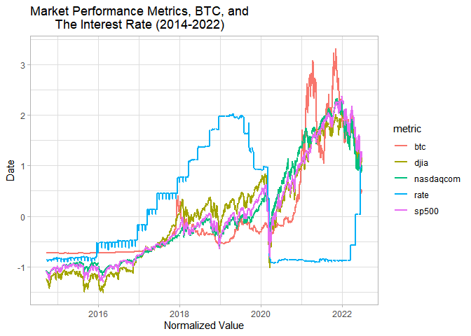
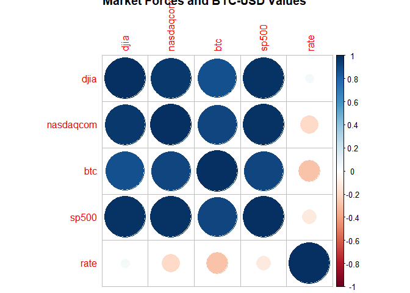
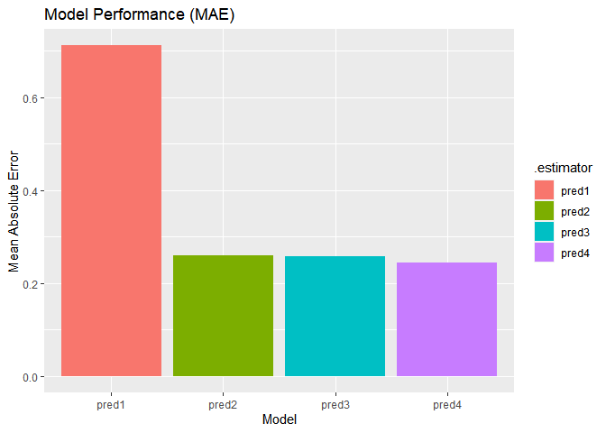
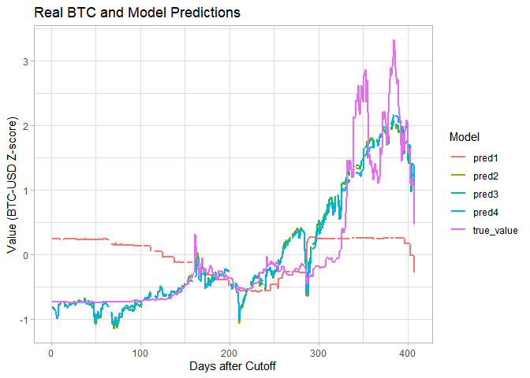
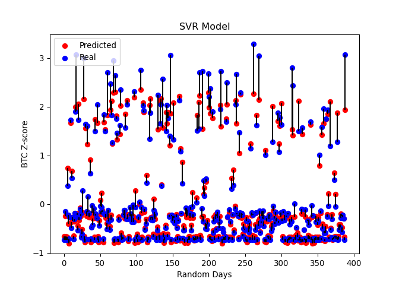
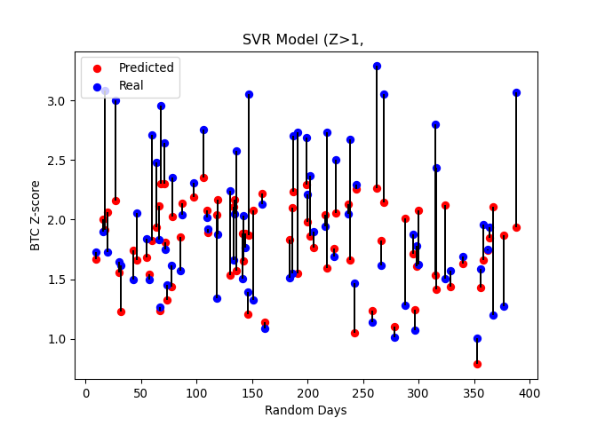
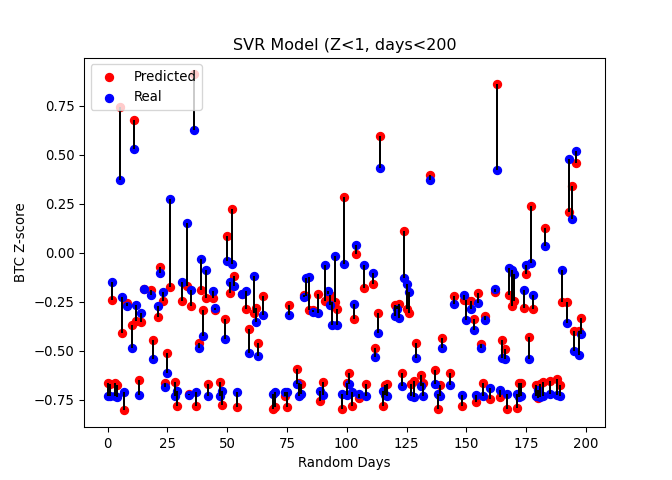
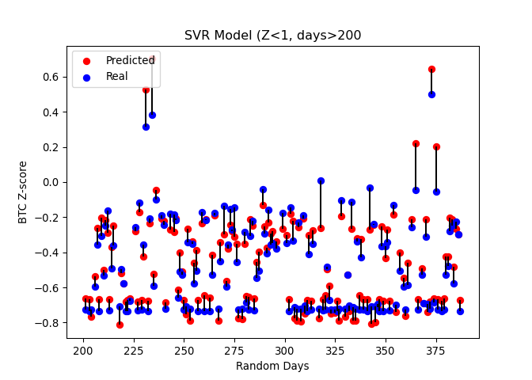
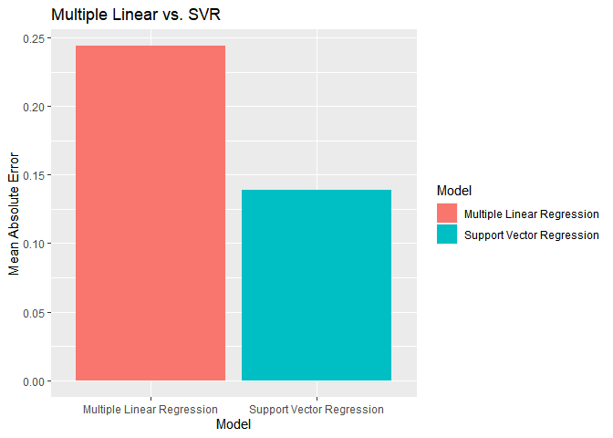

Predicting Bitcoin Prices with Market Conditions
================
Connor Burton
2022-07-02

## Visualization and Linear Regression in R

This project uses market conditions to describe variation in Bitcoin-USD
exchange rates in order to support the idea that BTC currently functions
as a store of USD value (like gold or stocks) rather than a fully
independent/decentralized currency, as cryptocurrency proponents claim.
In this project, I train four linear regression models and one support
vector regression model to predict BTC-USD rates on a normalized scale.

``` r
#libs
library(tidyverse)
library(janitor)
library(plotly)
library(corrplot)
library(stargazer)
library(tidymodels)
```

To begin, I utilized daily data on the NASDAQ, the Dow Jones Industrial
Average, the S&P 500, and Bitcoin closing prices for the years of
2014-2022. These data are available from FRED and Yahoo Finance online.

I start below by loading the data, cleaning them, and visualizing their
variation over time.

``` r
#reading in and cleaning names
nas = read.csv("NASDAQ_df.csv") |> clean_names()
dow = read.csv("DJIA_df.csv")|> clean_names()
ffr = read.csv("nyfed_effr.csv")|> clean_names()
btc = read.csv("BTC-USD_df.csv")|> clean_names()
sp = read.csv("SP500_df.csv")|> clean_names()

#dropping excess columns, useing adj. closed as value 
btc = btc[,c(1,6)]

#changing col names
names(btc)[2] = "btc"
names(ffr)[1] = "date"

#fixing dates for table joins
ffr$date = gsub("/", "-", ffr$date)
ffr$date = 
  as.Date(ffr$date, format="%m-%d-%Y") |> 
  as.character()

#converting characters to numeric
nas$nasdaqcom = as.numeric(nas$nasdaqcom)
sp$sp500 = as.numeric(sp$sp500)
dow$djia = as.numeric(dow$djia)

#joining all data by date
df = left_join(nas, btc, by = "date")
df = left_join(dow, df, by = "date")
df = left_join(df, sp, by = "date")
df = left_join(df, ffr, by = "date")

#storing date as a date variable
df$date = lubridate::as_date(df$date)

#normalizing all data and rebinding date column
date = df$date
df = as.data.frame(scale(df[2:6]))
df = cbind(date, df)

#pivoting for a better plot/legend
df2 = pivot_longer(
  data = df, cols = c('djia', 'nasdaqcom', 'btc', 'sp500', 'rate'),
  names_to = "metric", 
  values_to = "value")

#plotting
ggplot(data = df2, aes(x = date, y = value, color = metric)) + 
  geom_line(size = 1) + 
  theme_light() + 
  labs(title = "Market Performance Metrics, BTC, and 
       The Interest Rate (2014-2022)",
       x = "Normalized Value",
       y = "Date")
```

<!-- -->

It appears from the plot above that Bitcoin may vary slightly with
market conditions and the interest rate, however this correlation is not
stable, implying that conditions other than market metrics may be
involved in BTC variation. To yield a better understanding, I plot a
correlation matrix below.

``` r
#Correlation Matrix 
corrplot(cor(df[2:6], use = 'complete.obs'), 
         title = "Market Forces and BTC-USD Values")
```

<!-- -->

Following this, I train four linear regression models, each with an
increased number of explanatory variables. All data are normalized to
avoid issues of scale on different metrics. These data are trained on
the first 1624 daily observations and tested on the last 407 daily
observations. Notably, these splits are based on date rather than
randomly selected. This is primarily for visualization purposes and is
addressed in the SVR model toward the end.

### Model 1:


### Model 2:


### Model 3:


### Model 4:


``` r
#splitting into training and testing with seed
set.seed(722022407)
train_obs = sort(sample(nrow(df), nrow(df)*.8))
train = df[train_obs,]
test = df[-train_obs,]

#defining several regressions and outputting a table
reg1 = lm(data = train, btc ~ rate )
reg2 = lm(data = train, btc ~ rate + djia )
reg3 = lm(data = train, btc ~ rate + djia + nasdaqcom)
reg4 = lm(data = train, btc ~ rate + djia + nasdaqcom + sp500)
stargazer(reg1, reg2, reg3, reg4, type = "text")
```

    ## 
    ## =================================================================================================================================
    ##                                                                  Dependent variable:                                             
    ##                     -------------------------------------------------------------------------------------------------------------
    ##                                                                          btc                                                     
    ##                                (1)                        (2)                         (3)                         (4)            
    ## ---------------------------------------------------------------------------------------------------------------------------------
    ## rate                        -0.285***                  -0.324***                   -0.293***                   -0.199***         
    ##                              (0.025)                    (0.009)                     (0.020)                     (0.022)          
    ##                                                                                                                                  
    ## djia                                                   0.890***                    0.765***                      0.107           
    ##                                                         (0.009)                     (0.071)                     (0.107)          
    ##                                                                                                                                  
    ## nasdaqcom                                                                           0.129*                      -0.105           
    ##                                                                                     (0.073)                     (0.077)          
    ##                                                                                                                                  
    ## sp500                                                                                                          0.892***          
    ##                                                                                                                 (0.111)          
    ##                                                                                                                                  
    ## Constant                      0.004                      0.003                       0.003                       0.002           
    ##                              (0.024)                    (0.009)                     (0.009)                     (0.009)          
    ##                                                                                                                                  
    ## ---------------------------------------------------------------------------------------------------------------------------------
    ## Observations                  1,568                      1,558                       1,558                       1,558           
    ## R2                            0.079                      0.870                       0.871                       0.876           
    ## Adjusted R2                   0.079                      0.870                       0.870                       0.875           
    ## Residual Std. Error     0.966 (df = 1566)          0.362 (df = 1555)           0.362 (df = 1554)           0.354 (df = 1553)     
    ## F Statistic         135.221*** (df = 1; 1566) 5,215.187*** (df = 2; 1555) 3,482.654*** (df = 3; 1554) 2,734.837*** (df = 4; 1553)
    ## =================================================================================================================================
    ## Note:                                                                                                 *p<0.1; **p<0.05; ***p<0.01

``` r
#making predictions on test data
pred1 = predict(reg1, test)
pred2 = predict(reg2, test)
pred3 = predict(reg3, test)
pred4 = predict(reg4, test)
```

With the regressions trained and tested on new data, I visualize model
performance below, with mean average error of test-data prediction
utilized as the performance metric.

``` r
### Plotting MAE

#binding predictions
predictions = 
  cbind(test$btc, pred1, pred2, pred3, pred4) |> 
  as.data.frame()
names(predictions)[1] = "true_value"

#getting mae for each model
error1 = 
  mae(predictions, truth = "true_value", estimate = "pred1") |>
  as.data.frame()
error2 = 
  mae(predictions, truth = "true_value", estimate = "pred2") |>
  as.data.frame()
error3 = 
  mae(predictions, truth = "true_value", estimate = "pred3") |>
  as.data.frame()
error4 = 
  mae(predictions, truth = "true_value", estimate = "pred4") |>
  as.data.frame()

#binding mae
errors = rbind(error1, error2, error3, error4)
errors[2] = c("pred1", "pred2", "pred3", "pred4")

#plotting mae
ggplot(data = errors, 
       aes(y = .estimate, x = .estimator, fill = .estimator)) + 
  geom_col() + 
  labs(title = "Model Performance (MAE)",
       x = "Model",
       y = "Mean Absolute Error")
```

<!-- -->

Below, I plot the true values of BTC-USD against the predicted values
from each successive model.

``` r
### Plotting predicted values

#pivoting for a better plot/legend
predictions$fake_time = c(1:407)
predictions2 = pivot_longer(data = predictions, cols = c('true_value', 'pred1', 'pred2', 'pred3', 'pred4'),
                   names_to = "Model", 
                   values_to = "Prediction")

#plotting
ggplot(data = predictions2, 
         aes(x = fake_time, y = Prediction, color = Model)) + 
  geom_line(size = 1) + 
  theme_light() + 
  labs(title = "Real BTC and Model Predictions",
       y = "Value (BTC-USD Z-score)",
       x = "Days after Cutoff")
```

<!-- -->

``` r
#saving master dataset as csv for python import
write.csv(df, 'crypto_df.csv', row.names = FALSE)
```

## Python ML Modeling with SVR

``` python
#importing libraries
import numpy as np
import matplotlib.pyplot as plt
import pandas as pd
import datetime
import warnings
```

Here, I import the data from the previous R work and clean it to
function in Python.

``` python
#grabbing saved data
df = pd.read_csv('crypto_df.csv')

#converting from character to date format
df["date"] = pd.to_datetime(df["date"], format='%Y.%m.%d', errors='coerce').dt.date
df.head

#storing colnames for reapplication 
```

    ## <bound method NDFrame.head of             date      djia  nasdaqcom       btc     sp500      rate
    ## 0     2014-09-17 -1.255739  -1.087367 -0.720817 -1.098150 -0.870022
    ## 1     2014-09-18 -1.237252  -1.078050 -0.722799 -1.085965 -0.870022
    ## 2     2014-09-19 -1.234923  -1.082118 -0.724585 -1.087160 -0.870022
    ## 3     2014-09-22 -1.253058  -1.097655 -0.724142 -1.107210 -0.870022
    ## 4     2014-09-23 -1.272844  -1.103321 -0.722115 -1.121548 -0.870022
    ## ...          ...       ...        ...       ...       ...       ...
    ## 2026  2022-06-23  1.034465   0.901781  0.522333  1.134841  0.963094
    ## 2027  2022-06-24  1.173925   1.013743  0.531118  1.279226  0.963094
    ## 2028  2022-06-27  1.163352   0.988970  0.501217  1.264752  0.963094
    ## 2029  2022-06-28  1.080137   0.886676  0.473806  1.166977  0.963094
    ## 2030  2022-06-29  1.094081   0.885588  0.463163  1.163591  0.963094
    ## 
    ## [2031 rows x 6 columns]>

``` python
colnames = list(df)

#dropping NAs
df = pd.DataFrame(df.dropna().values)
df.columns = colnames
```

I begin this analysis by setting up the training and testing data for
the SVR model using a random 80-20 split.

``` python
#hiding unnecessary warnings
warnings.filterwarnings('ignore')

#defining independent and dependent vars
X = df[['djia', 'nasdaqcom', 'sp500', 'rate']]
y = df[['btc']]
y = np.array(y).reshape(-1,1)

#defining training/testing
from sklearn.model_selection import train_test_split
X_train, X_test, y_train, y_test = train_test_split(X, y, test_size = 0.2)

#defining Support Vector Regression model
from sklearn.svm import SVR
regressor = SVR(kernel = 'rbf')
regressor.fit(X_train, y_train.ravel())

#predicting output
```

    ## SVR()

``` python
y_pred = regressor.predict(X_test)
df_pred = pd.DataFrame({'Real Values':(y_test.reshape(-1)), 'Predicted Values':y_pred})
df_pred['fake_date'] = np.arange(len(df_pred))
```

With the model trained, I test it on new data and visualize its
performance below using a scatter plot and error lines. Blue points
represent the true value of BTC-USD while red points show the predicted
values. Lines are drawn to help the reader see which predictions are
aligned with which true values.

``` python
### Visualization 
#defining axes and labels
plt.scatter((df_pred['fake_date']), (df_pred['Predicted Values']), color = 'red', label = "Predicted")
plt.scatter((df_pred['fake_date']), (df_pred['Real Values']), color = 'blue', label = "Real")
plt.title('SVR Model')
plt.xlabel('Random Days')
plt.ylabel('BTC Z-score')
plt.legend(loc="upper left")

#creating error lines
avg_line = (df_pred['Predicted Values'] + df_pred['Real Values'])*0.5
err = (avg_line - df_pred['Predicted Values']).abs()
plt.errorbar(df_pred['fake_date'], avg_line.values, yerr=err.values, fmt= 'none', ecolor = 'k', barsabove = False, capthick=0)

#show plot
```

    ## <ErrorbarContainer object of 3 artists>

``` python
plt.show()
```

<!-- -->

This plot is a little difficult to read, so I split the data by its
Z-score value (with 1 as the threshold) and split the lower values by
half along the random day observations, in order to clear up the plots:

``` python
#splitting for better viz
pred_upper = df_pred.where(df_pred['Real Values'] > 1)
pred_lower = df_pred.where(df_pred['Real Values'] < 1)
pred_lower1 = pred_lower.where(pred_lower['fake_date'] < 199)
pred_lower2 = pred_lower.where(pred_lower['fake_date'] > 200)
```

### Visualizing Predictions with Z\>1

``` python
#hiding unnecessary warnings
warnings.filterwarnings('ignore')

##upper plot
plt.clf()
plt.scatter((pred_upper['fake_date']), (pred_upper['Predicted Values']), color = 'red', label = "Predicted")
plt.scatter((pred_upper['fake_date']), (pred_upper['Real Values']), color = 'blue', label = "Real")
plt.title('SVR Model (Z>1, ')
plt.xlabel('Random Days')
plt.ylabel('BTC Z-score')
plt.legend(loc="upper left")

#creating error lines
avg_line2 = (pred_upper['Predicted Values'] + pred_upper['Real Values'])*0.5
err2 = (avg_line2 - pred_upper['Predicted Values']).abs()
plt.errorbar(pred_upper['fake_date'], avg_line2.values, yerr=err2.values, fmt= 'none', ecolor = 'k', barsabove = False, capthick=0)

#show plot
```

    ## <ErrorbarContainer object of 3 artists>

``` python
plt.show()
```

<!-- -->

### Visualizing Predictions with Z\<1, (first \~200 obs.)

``` python
#hiding unnecessary warnings
warnings.filterwarnings('ignore')

## Lower plot 1
plt.clf()
plt.scatter((pred_lower1['fake_date']), (pred_lower1['Predicted Values']), color = 'red', label = "Predicted")
plt.scatter((pred_lower1['fake_date']), (pred_lower1['Real Values']), color = 'blue', label = "Real")
plt.title('SVR Model (Z<1, days<200')
plt.xlabel('Random Days')
plt.ylabel('BTC Z-score')
plt.legend(loc="upper left")

#creating error lines
avg_line3 = (pred_lower1['Predicted Values'] + pred_lower1['Real Values'])*0.5
err3 = (avg_line3 - pred_lower1['Predicted Values']).abs()
plt.errorbar(pred_lower1['fake_date'], avg_line3.values, yerr=err3.values, fmt= 'none', ecolor = 'k', barsabove = False, capthick=0)

#show plot
```

    ## <ErrorbarContainer object of 3 artists>

``` python
plt.show()
```

<!-- -->

### Visualizing Predictions with Z\<1, (last \~200 obs.)

``` python
#hiding unnecessary warnings
warnings.filterwarnings('ignore')

## Lower plot 2
plt.clf()
plt.scatter((pred_lower2['fake_date']), (pred_lower2['Predicted Values']), color = 'red', label = "Predicted")
plt.scatter((pred_lower2['fake_date']), (pred_lower2['Real Values']), color = 'blue', label = "Real")
plt.title('SVR Model (Z<1, days>200')
plt.xlabel('Random Days')
plt.ylabel('BTC Z-score')
plt.legend(loc="upper left")

#creating error lines
avg_line4 = (pred_lower2['Predicted Values'] + pred_lower2['Real Values'])*0.5
err4 = (avg_line4 - pred_lower2['Predicted Values']).abs()
plt.errorbar(pred_lower2['fake_date'], avg_line4.values, yerr=err4.values, fmt= 'none', ecolor = 'k', barsabove = False, capthick=0)

#show plot
```

    ## <ErrorbarContainer object of 3 artists>

``` python
plt.show()
```

<!-- -->

Below, I yield the mean average error of this SVR model and plot it
against the best-performing multiple regression model. It is clear that
this model outperforms the best-performing multi-regression model. This
is likely a function of true randomization and the train-test split, as
well as possibly the different model specification.

``` python
#Mean absolute error for linear regression comparison
from sklearn.metrics import mean_absolute_error, mean_squared_error
mae = mean_absolute_error(df_pred["Predicted Values"], df_pred["Real Values"])
```

    ## The SVR Model Mean Average Error is equal to  0.14708738547631167

    ## The lowest MAE in linear regressions was equal to 0.243820197018541

    ## This marks a Z-score improvement of  0.09673281154222932

``` r
#Comparing best linear reg and SVR
Model = c("Multiple Linear Regression", "Support Vector Regression")
Values = c(0.243820197018541, 0.13887354467766053)
comparison = cbind(Model, Values) |> as.data.frame()
comparison$Values = as.numeric(comparison$Values)

ggplot(data = comparison, aes(x = Model, y = Values, fill = Model)) + 
         geom_col() + 
  labs(title = "Multiple Linear vs. SVR",
       y = "Mean Absolute Error")
```

<!-- -->
